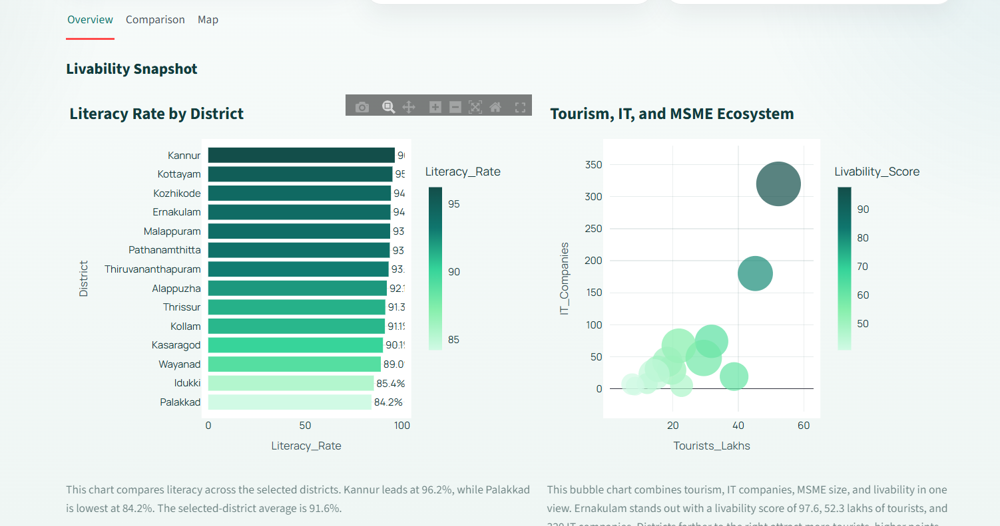
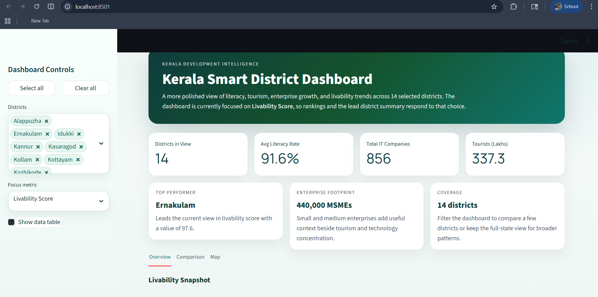
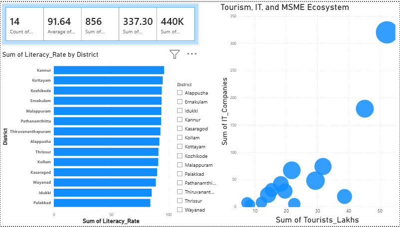
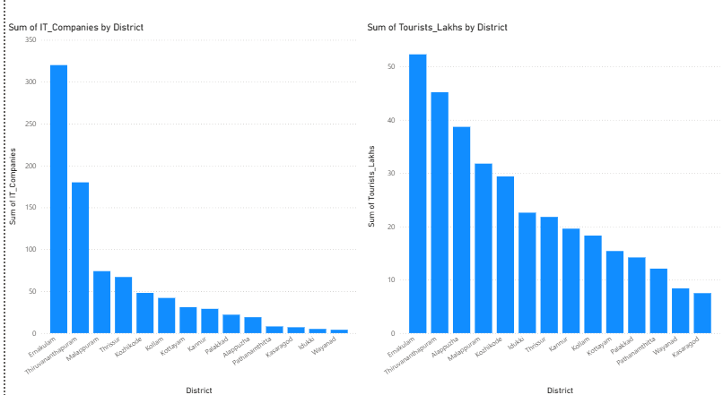

# Kerala District Power BI Dashboard

Interactive Kerala district data analysis project built with Streamlit and Power BI. The project explores literacy, tourism, IT company presence, MSME distribution, and a derived livability score across Kerala districts.

## Project Overview

This project presents the same district-level dataset in two formats:

- A Streamlit dashboard for interactive web-based exploration
- A Power BI report for business intelligence reporting and presentation

The dashboard is designed to compare district performance using summary cards, ranking charts, ecosystem analysis, and a district map.

## Key Features

- District-wise literacy comparison
- Tourist arrivals analysis
- IT companies by district
- MSME-based ecosystem comparison
- Livability score ranking
- Interactive district filtering
- Kerala district map view
- Power BI report version of the same dataset

## Dataset

The project uses a Kerala district dataset with the following columns:

- `District`
- `Literacy_Rate`
- `Tourists_Lakhs`
- `IT_Companies`
- `MSME_Count`
- `Latitude`
- `Longitude`
- `Livability_Score`

Primary dataset file:

- `kerala_dashboard_dataset.csv`

Supporting Python dataset source:

- `kerala_data.py`

## Tools and Technologies Used

- Python
- Streamlit
- Pandas
- Plotly Express
- Folium
- streamlit-folium
- Power BI
- Git
- GitHub
- CSV

## Streamlit Dashboard

Main Streamlit app file:

- `app.py`

Run the dashboard locally:

```bash
streamlit run app.py
```

## Power BI Report

Power BI report file:

- `Kerala_Dashboard.pbix`

To use the same data in Power BI, import:

- `kerala_dashboard_dataset.csv`

## Dashboard Screenshots

### Streamlit Dashboard





### Power BI Dashboard





## Repository Structure

- `app.py` - Streamlit dashboard application
- `kerala_data.py` - Python data source and livability score logic
- `kerala_dashboard_dataset.csv` - CSV dataset for analysis and Power BI
- `Kerala_Dashboard.pbix` - Power BI report
- `screenshots/` - Dashboard screenshots used in the README

## Learning Focus

This project demonstrates practical skills in:

- data cleaning and structuring
- dashboard development
- business intelligence reporting
- interactive visualization
- Git and GitHub project publishing

## Author

Created as a portfolio project to demonstrate data analytics, dashboard design, and reporting skills using Streamlit and Power BI.
